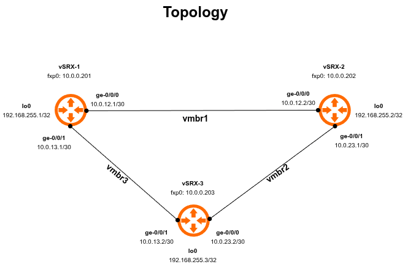

# Juniper vSRX OSPF Lab

A fully automated Juniper vSRX OSPF lab running on Proxmox VE, 
configured with Ansible.

## Topology


## Requirements

- Proxmox VE
- Juniper vSRX qcow2 image (23.2R2+)
- Ansible 2.14+
- Python 3.x
- junipernetworks.junos collection

## Installation

### 1. Install dependencies
```bash
sudo dnf install ansible python3-pip -y
ansible-galaxy collection install junipernetworks.junos
pip install ncclient --user
```

### 2. Clone the repo
```bash
git clone https://github.com/<yourusername>/juniper-ospf-lab.git
cd juniper-ospf-lab
```

### 3. Configure credentials
```bash
cp ansible/group_vars/juniper.yml.example ansible/group_vars/juniper.yml
nano ansible/group_vars/juniper.yml  # add your credentials
```

### 4. Configure SSH jump host
Add to `~/.ssh/config`:
```
Host proxmox
    HostName <proxmox-ip>
    User root

Host vsrx-*
    User labuser
    ProxyCommand ssh -W %h:%p proxmox
    StrictHostKeyChecking no

Host vsrx-1
    HostName 10.0.0.201
Host vsrx-2
    HostName 10.0.0.202
Host vsrx-3
    HostName 10.0.0.203
```

### 5. Run the full lab setup
```bash
cd ansible
ansible-playbook -i inventory/hosts.yml site.yml
```

## Playbooks

| Playbook | Description |
|----------|-------------|
| `site.yml` | Full lab setup (base + interfaces + OSPF) |
| `get_facts.yml` | Gather and display device facts |
| `configure_ntp.yml` | Configure NTP servers |
| `configure_interfaces.yml` | Configure interface IPs |
| `configure_ospf.yml` | Configure OSPF |

## Roles

| Role | Description |
|------|-------------|
| `base` | Hostname, NTP, DNS |
| `interfaces` | IP addressing and descriptions |
| `ospf` | OSPF area 0 configuration |

## Verification
```bash
# Check OSPF neighbors
ansible juniper -i inventory/hosts.yml -m junipernetworks.junos.junos_command \
  -a "commands='show ospf neighbor'"

# Get device facts
ansible-playbook -i inventory/hosts.yml get_facts.yml
```